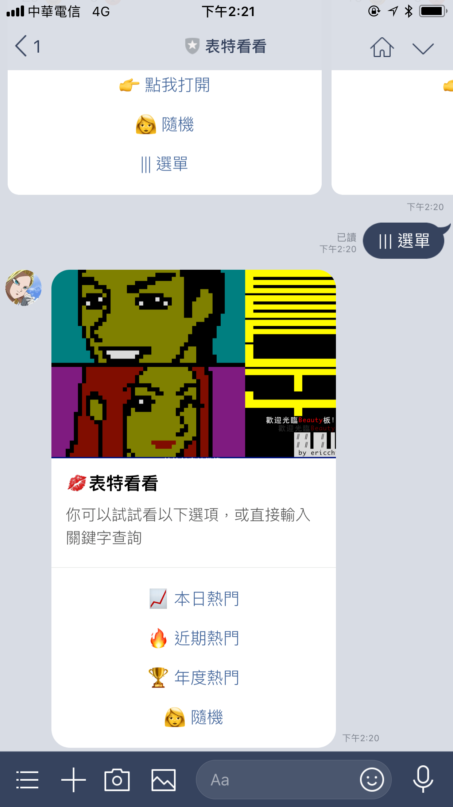

# 表特看看 - LINE 聊天機器人 for PTT Beauty

   

# How to use it

## For User

### 掃描 QR Code 或點選連結

## For Developer

### Installation and Usage

#### Deploy on Web Platform

- Deploy on [Heroku](https://heroku.com)

- Deploy on [Reder.com](https://render.com)

More detail, please check my [LINE Bot Template project](https://github.com/kkdai/LineBotTemplate).

### 截圖

- 功能選單

- 熱門照片

- 對話直接搜尋

